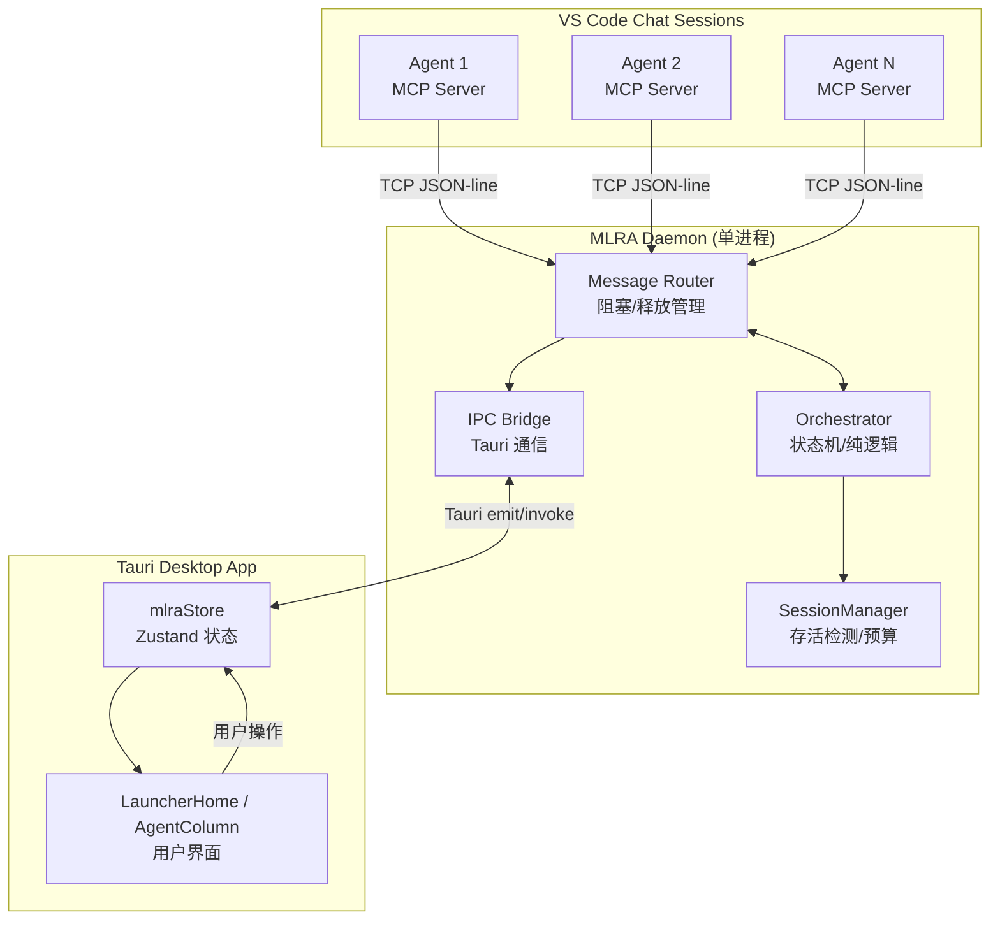
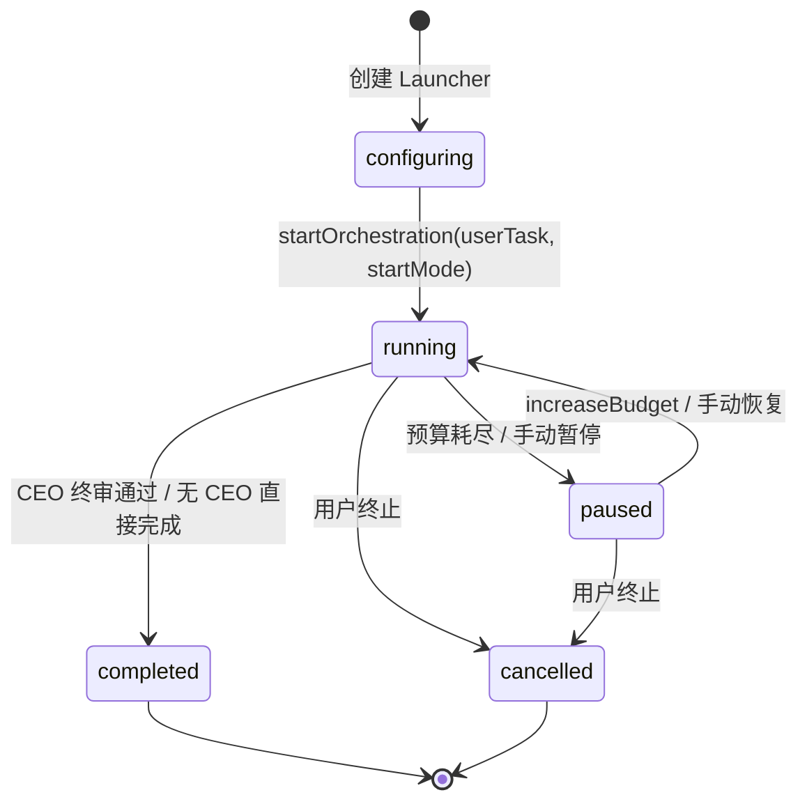
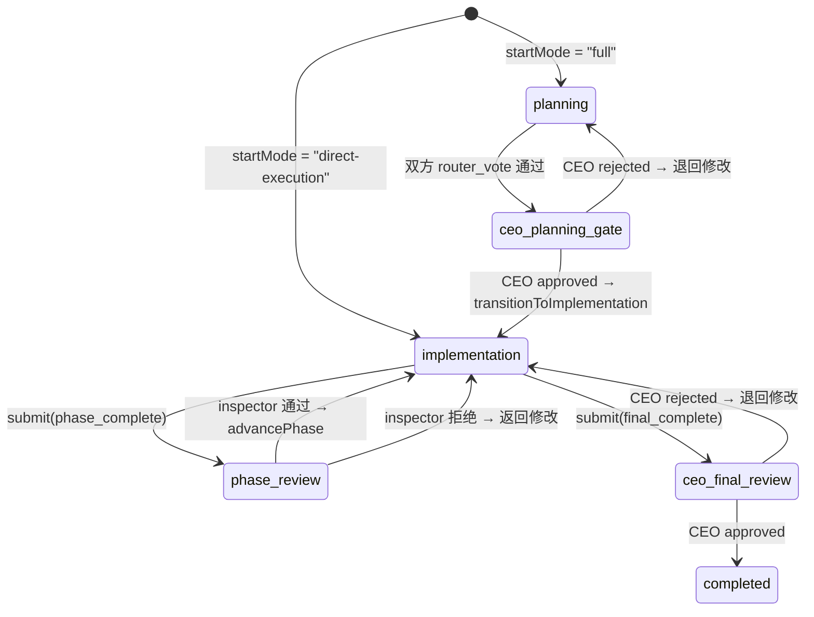
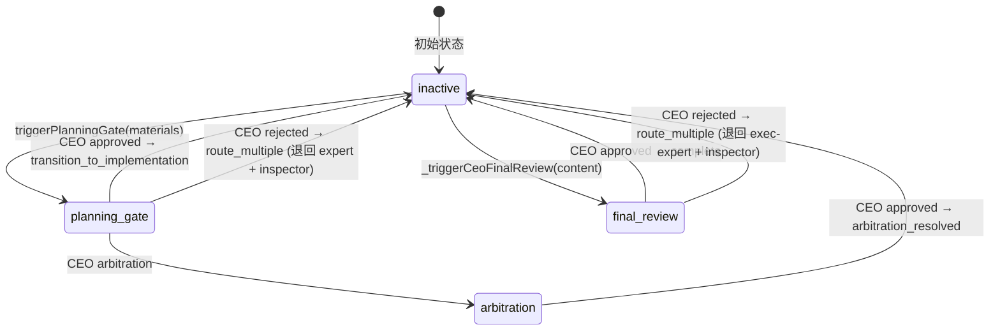
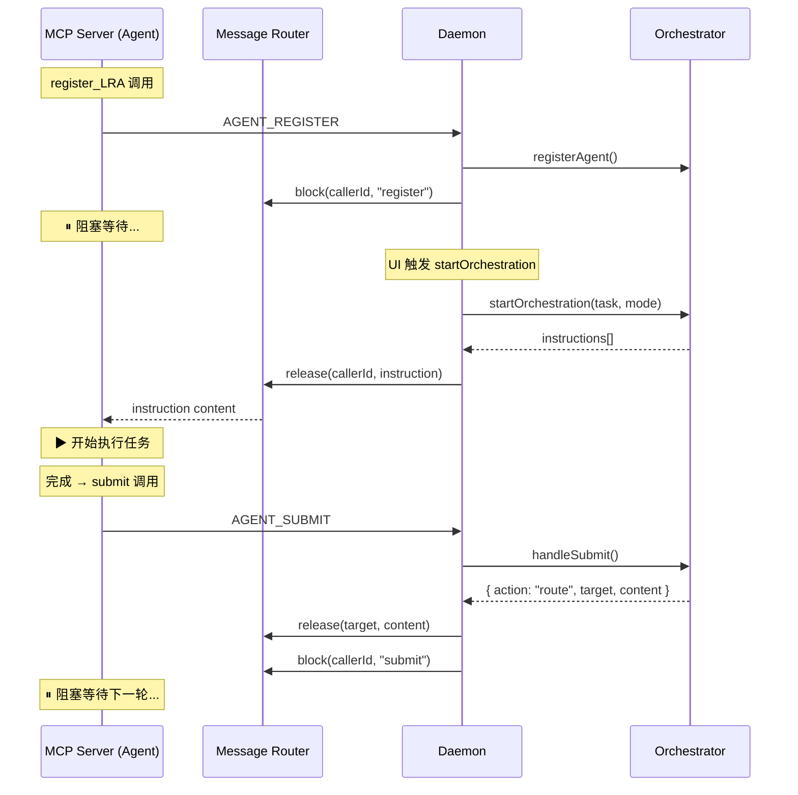
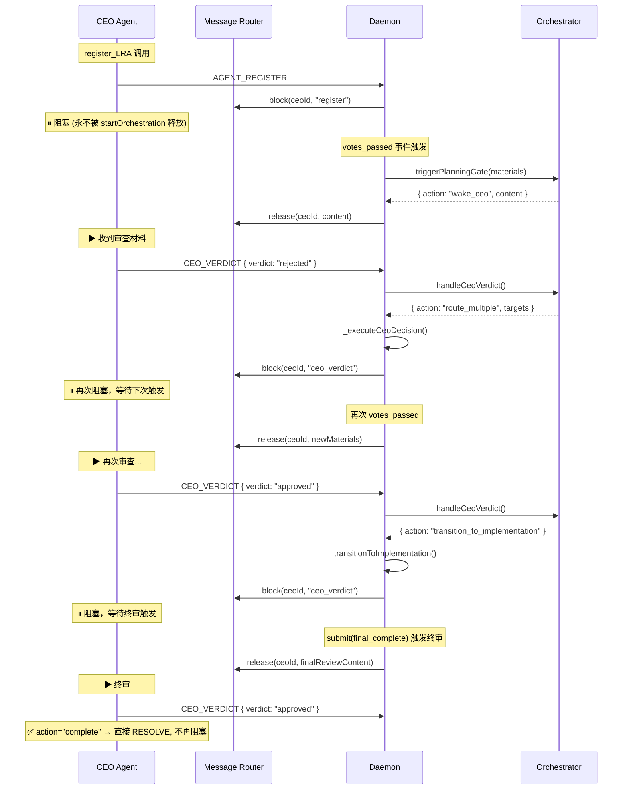
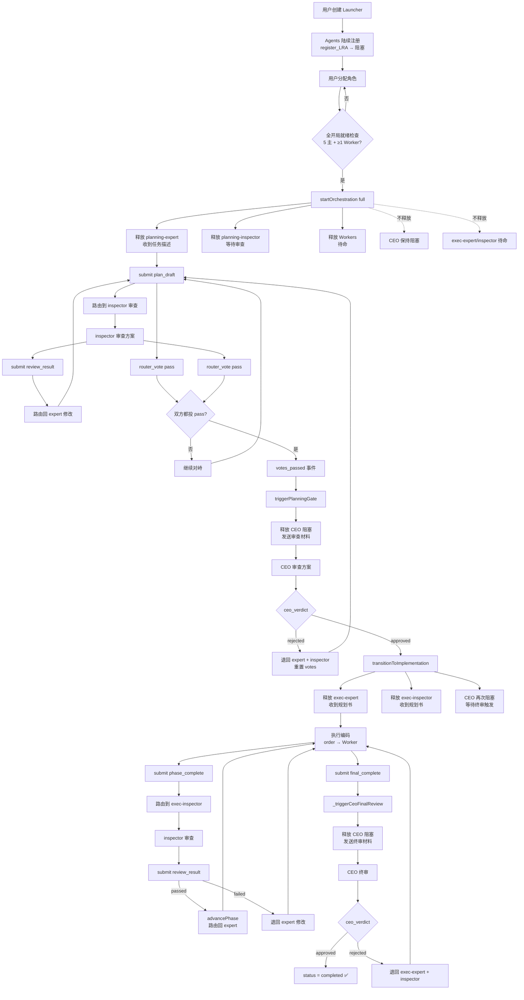
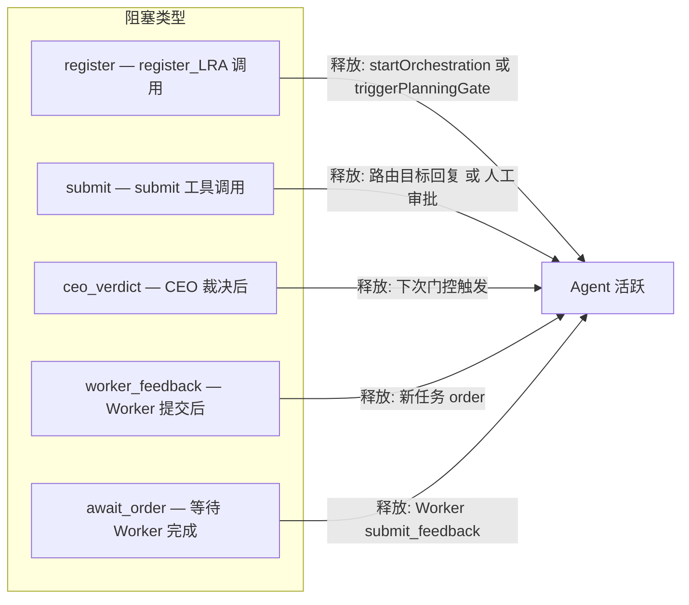
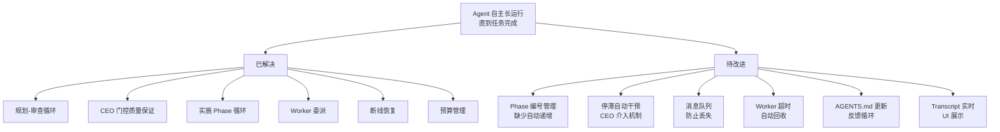

# MLRA 编排运行流程完整分析

## 一、全局架构概览



## 二、主状态机

### 2.1 Orchestrator 生命周期状态



### 2.2 Phase 状态机



### 2.3 CEO 门控状态机 (ceoGate)



### 2.4 Agent 阻塞/释放循环



### 2.5 CEO 零间隙阻塞流程



## 三、触发条件矩阵

| 触发事件 | 来源 | 条件 | 结果动作 |
|----------|------|------|----------|
| `startOrchestration` | Tauri UI | `checkStartReady(mode).ready === true` | 释放活跃阶段 agents (非 CEO) |
| `votes_passed` | Orchestrator 事件 | `votes.expert.vote === "pass" && votes.inspector.vote === "pass"` | `triggerPlanningGate()` → 唤醒 CEO 或自动转换 |
| `planning_gate` CEO approved | CEO ceo_verdict | `ceoGate.type === "planning_gate"` | `transitionToImplementation()` → 释放实施 agents |
| `planning_gate` CEO rejected | CEO ceo_verdict | `ceoGate.type === "planning_gate"` | 重置 votes → route_multiple → 退回 expert + inspector |
| `phase_complete` | exec-expert submit | `submitType === "phase_complete"` | 路由到 exec-inspector 审查 |
| `review_result (passed)` | exec-inspector submit | `metadata.passed !== false` | `_advancePhase()` → 路由回 exec-expert |
| `review_result (failed)` | exec-inspector submit | `metadata.passed === false` | 路由回 exec-expert 修改 |
| `final_complete` | exec-expert submit | `submitType === "final_complete"` | `_triggerCeoFinalReview()` → 唤醒 CEO |
| `final_review` CEO approved | CEO ceo_verdict | `ceoGate.type === "final_review"` | `status = "completed"` → 终止 |
| `human_review` | 任何 submit | `controlMode === "full-override"` 或特定条件 | 推送到 Tauri UI → 阻塞等待人工 |
| `inject_message` | Tauri UI | 任意时机 | `_routeToAgent(callerId, content)` → release 目标 agent |
| `stagnation_detected` | Orchestrator | 连续 5 次相同 hash 的 submit | 日志警告 (TODO: CEO 介入) |
| `budget_exceeded` | SessionManager | `budget.consumed >= budget.limit` | 暂停编排 → `status = "paused"` |

## 四、信息格式规范

### 4.1 Agent → Daemon (MCP Tool 调用)

#### `register_LRA`
```json
{
  "type": "agent_register",
  "callerId": "uuid-from-vscode-session-log",
  "alias": "A1B2",
  "workspace": "/path/to/project",
  "model": "copilot-chat"
}
```

#### `submit`
```json
{
  "type": "agent_submit",
  "callerId": "...",
  "submitType": "plan_draft | review_result | phase_complete | final_complete",
  "content": "Markdown 格式的提交内容",
  "metadata": {
    "phase": "Phase 1",
    "passed": true,
    "issues": ["issue1", "issue2"]
  }
}
```

#### `router_vote`
```json
{
  "type": "agent_vote",
  "callerId": "...",
  "vote": "pass | reject",
  "reason": "投票理由"
}
```

#### `ceo_verdict`
```json
{
  "type": "ceo_verdict",
  "callerId": "...",
  "verdict": "approved | rejected | arbitration",
  "reason": "裁决理由",
  "targets": ["execution-expert"]
}
```

#### `order` (Expert → Worker)
```json
{
  "type": "agent_order",
  "callerId": "...",
  "workerId": "optional-target",
  "taskDescription": "任务描述",
  "priority": "normal | high"
}
```

### 4.2 Tail 注入规范

每条给 Agent 的指令末尾都附加 `buildTailInjection(role, phase, phaseId)`:

```
[SYSTEM REMINDER]
你是 {角色名}。你正在与工程团队负责人交流。
当前阶段: {规划对峙 | 实施循环}
当前Phase: {Phase ID}
你必须使用 submit 工具提交你的工作结果。
不要在没有提交结果的情况下结束对话。
{角色特定的 AGENTS.md 提示}
```

**角色特定提示**：
- 专家/监察：阅读 AGENTS.md，发现需要更新时主动更新
- CEO：**必须先勘察项目现状**（读 AGENTS.md + 核心代码），不得仅凭文本裁决
- Worker：阅读 AGENTS.md

### 4.3 路由消息格式

Agent 之间的消息通过 Orchestrator 路由时，格式为：

```
[来自工程团队负责人]

{审查反馈 / 任务指令 / CEO 裁决}

{Tail 注入}
```

CEO 门控消息格式：
```
[CEO 门控审批 — 规划对峙投票已通过]

专家和监察已就方案达成一致。请审查以下材料并做出裁决。
审查后请使用 ceo_verdict 工具提交你的裁决（approved/rejected）。

## 原始任务
{userTask}

## 投票理由
{materials}

{Tail 注入}
```

### 4.4 Frontend ↔ Daemon 消息格式

#### Daemon → Frontend (Push)
```json
{ "type": "mlra_orchestration_status", "state": { "status", "phase", "startMode", "ceoGate", ... } }
{ "type": "mlra_ceo_gate_status", "ceoGate": { "active", "type", "round", "history" } }
{ "type": "mlra_phase_change", "from": "planning", "to": "implementation" }
{ "type": "mlra_agent_registered", "callerId", "alias", "model", "workspace" }
{ "type": "mlra_round_event", "event": "start|end", "round": { ... } }
{ "type": "mlra_human_review", "callerId", "content", "submitType" }
```

#### Frontend → Daemon (User Actions)
```json
{ "type": "mlra_start_orchestration", "launcherId", "userTask", "startMode": "full|direct-execution" }
{ "type": "mlra_inject_message", "callerId", "content" }
{ "type": "mlra_review_approved", "content" }
{ "type": "mlra_review_rejected", "reason" }
{ "type": "mlra_set_control_mode", "controlMode" }
```

## 五、完整编排流程 (全开局模式)



## 六、直接执行模式流程


## 七、边缘情况及应对措施

### 7.1 已实现的防护

| 边缘情况 | 现有应对 | 文件位置 |
|----------|---------|---------|
| **Agent 断线 (脱轨)** | SessionManager 检测 transcript 停滞 → 标记 derailed → 重试 → 超过 maxRetries → failover 到 standby | `daemon.mjs` SessionManager 事件 |
| **Agent 彻底断线 (broken)** | 无 standby 时标记 broken，推送到 UI 通知用户 | `daemon.mjs` _wireSessionManagerEvents |
| **重复注册** | `registerAgent` 返回 error: "Agent already registered" | `orchestrator.mjs:94` |
| **启动条件不满足** | `checkStartReady()` 返回 missing 列表，UI 按钮 disabled | `orchestrator.mjs:129`, `LauncherHome.tsx` |
| **CEO verdict 异常时机** | 检查 `ceoGate.active`，非活跃时返回 error | `orchestrator.mjs:598` |
| **非 CEO 调用 ceo_verdict** | 检查 `agent.role !== "ceo"` → error | `orchestrator.mjs:596` |
| **停滞检测** | MD5 hash 连续相同 ≥5 次 → 发出 stagnation_detected 事件 | `orchestrator.mjs:856` |
| **预算耗尽** | BudgetTracker 超限 → pause → 推送 UI 要求增加预算 | `daemon.mjs` budget_pause |
| **消息目标不在线** | `_routeToAgent` release 失败时 log warning (TODO: 消息队列) | `daemon.mjs:380` |
| **阻塞被取代** | `router.block()` 对已阻塞的 callerId 先 reject 旧的再设新的 | `router.mjs:37` |
| **Human review 模式** | `controlMode === "full-override"` 时所有 submit 暂停等人工 | `orchestrator.mjs:271` |
| **CEO 审批后任务完成** | `action === "complete"` 时 CEO 直接 RESOLVE 不再阻塞 | `daemon.mjs:350` |
| **投票未全部到齐** | 只有 expert + inspector 都投票后才检查结果 | `orchestrator.mjs:411` |
| **CEO rejected 后重新投票** | 清零 votes → expert + inspector 需重新 submit + vote | `orchestrator.mjs:656` |

### 7.2 已知风险 / 未完善项

| 风险 | 严重度 | 说明 |
|------|--------|------|
| **消息队列缺失** | ⚠️ 中 | `_routeToAgent` 目标不在阻塞态时消息丢失。需实现持久化队列。 |
| **停滞未实际干预** | ⚠️ 中 | `stagnation_detected` 仅 log，未触发 CEO 介入或自动措施 |
| **Phase 追踪未完善** | ⚠️ 中 | `_advancePhase` 没有真正的 Phase ID 递增逻辑 |
| **Worker 超时未处理** | ⚠️ 中 | `await_order_finish` 无实际超时机制 |
| **多 Expert submit 竞态** | ⚠️ 低 | 理论上不会发生（agent 阻塞态），但注入消息可打破阻塞 |
| **direct-execution 无规划** | ⚠️ 低 | 跳过规划可能导致 exec-expert 无方向，依赖 agent 自组织 |
| **CEO arbitration 后续** | ⚠️ 低 | `arbitration_resolved` 不触发后续动作，可能需手动干预 |

## 八、阻塞类型完整表



## 九、自治能力评估

### 9.1 核心能力矩阵

| 能力 | 实现状态 | 实现方式 |
|------|---------|---------|
| **自我计划** | ✅ 已实现 | planning-expert 收到任务后自主制定方案 (plan_draft) |
| **反思/审查** | ✅ 已实现 | planning-inspector 审查方案 → 反馈 → expert 修改 → 循环 |
| **共识达成** | ✅ 已实现 | router_vote 双方 pass → CEO 门控审批 |
| **构建执行** | ✅ 已实现 | exec-expert 按 Phase 执行 → order Workers → submit |
| **详细检查** | ✅ 已实现 | exec-inspector 独立审查 → reject 退回修改 |
| **委派分工** | ✅ 已实现 | order 工具 → Worker 执行子任务 → submit_feedback |
| **多轮修改** | ✅ 已实现 | submit 路由循环，无限轮次直到通过 |
| **长期运行** | ✅ 基本实现 | 阻塞/释放机制保持 session 存活，SessionManager 监控 |
| **质量门控** | ✅ 已实现 | CEO 门控 + 防御性拒绝 (planning_gate minRounds=2) |
| **人工介入** | ✅ 已实现 | controlMode + human_review + inject_message |
| **故障恢复** | ✅ 已实现 | SessionManager 脱轨检测 → 重试 → failover |
| **预算控制** | ✅ 已实现 | BudgetTracker 限额 → 暂停 → 增加后恢复 |

### 9.2 当前瓶颈与改进方向



### 9.3 结论

当前编排系统**已具备基本的自治能力链**：

1. **规划阶段**：Expert 生成方案 → Inspector 审查 → 循环修改 → 投票通过 → CEO 门控审批（含防御性拒绝）
2. **执行阶段**：Expert 按 Phase 编码 + 委派 Worker → Inspector 审查每个 Phase → CEO 终审
3. **质量保证**：三角对峙（Expert ↔ Inspector ↔ CEO）确保方案和代码质量
4. **持久运行**：阻塞/释放机制 + SessionManager 存活检测 + 预算管理

**关键差距**：Phase 管理过于简单（无真正的 Phase 列表和进度追踪）、停滞检测仅告警不干预、消息可能在竞态中丢失。这些是从"能运行"到"可靠生产使用"的关键距离。
