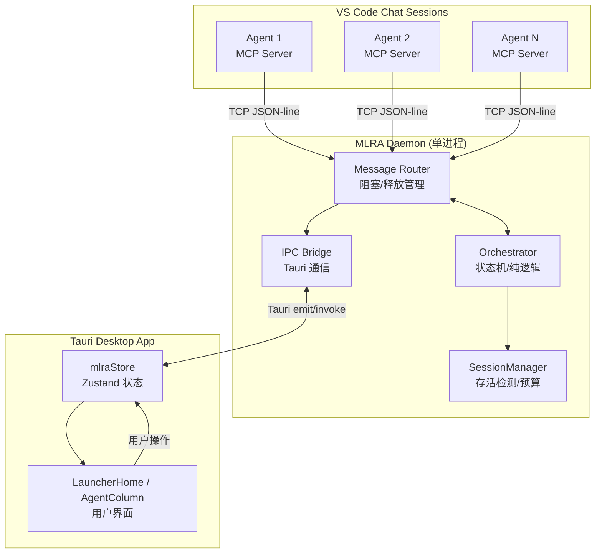
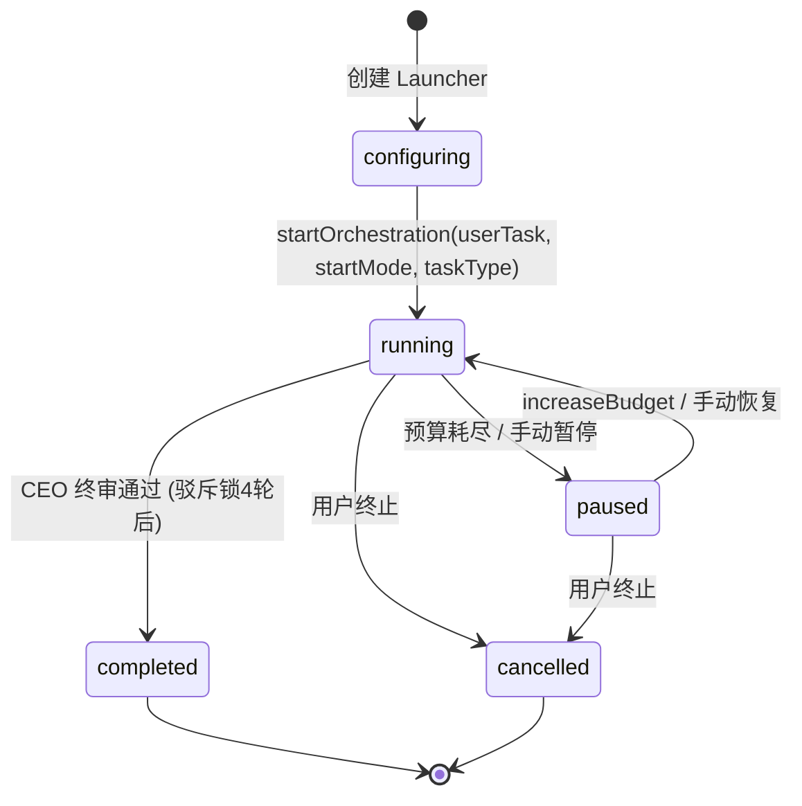
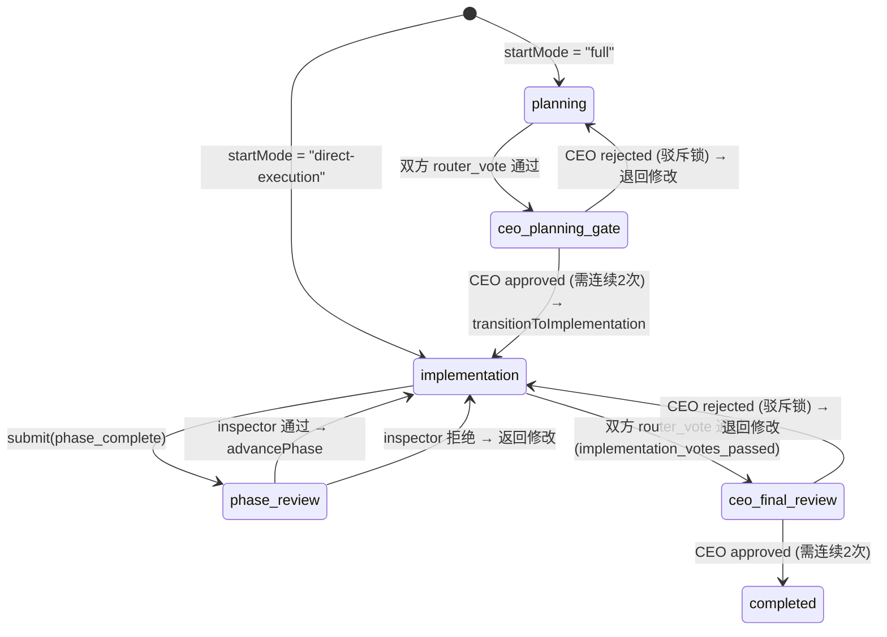
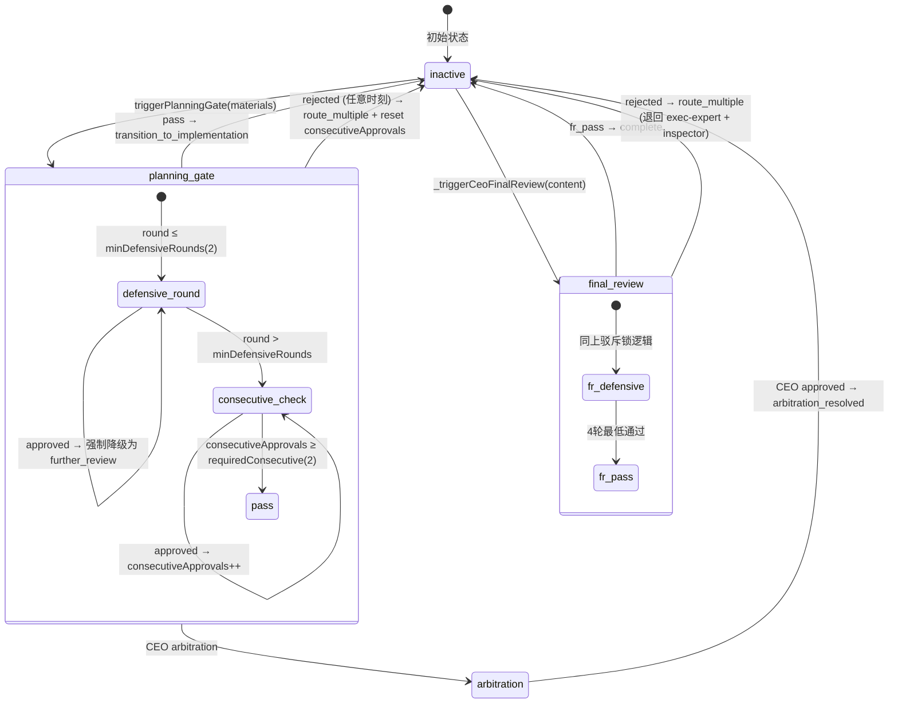
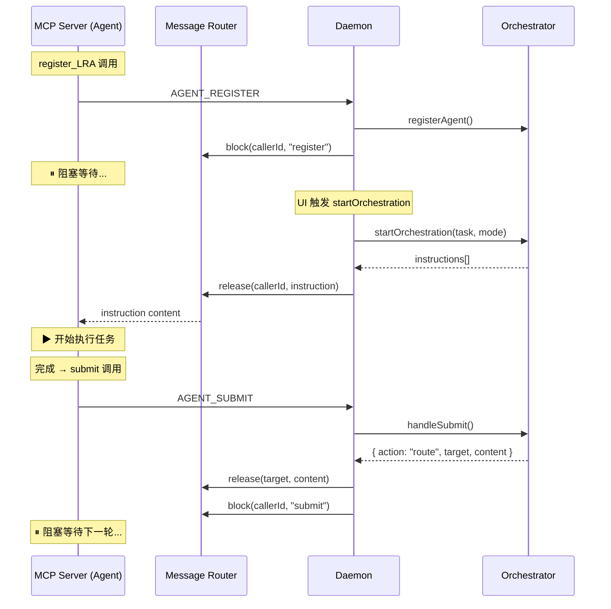
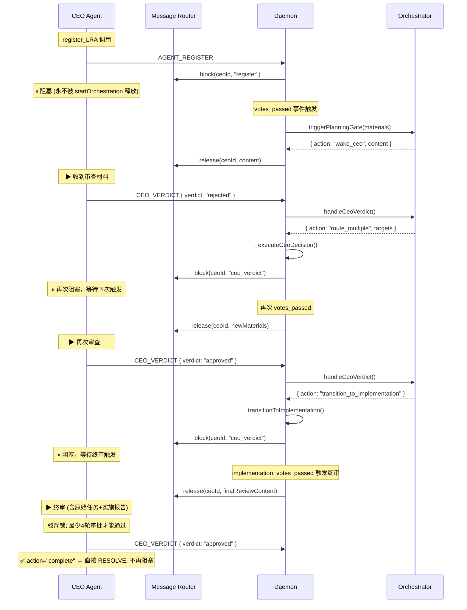
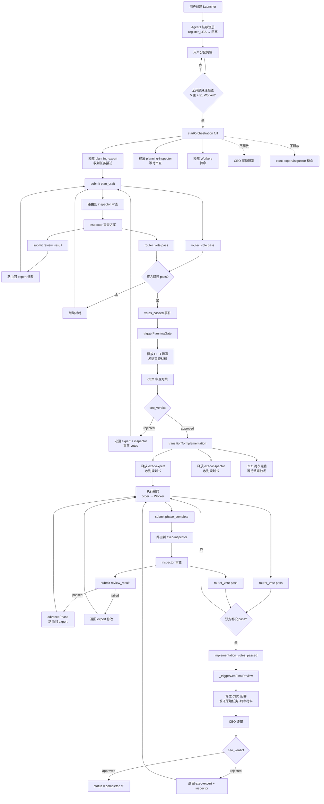
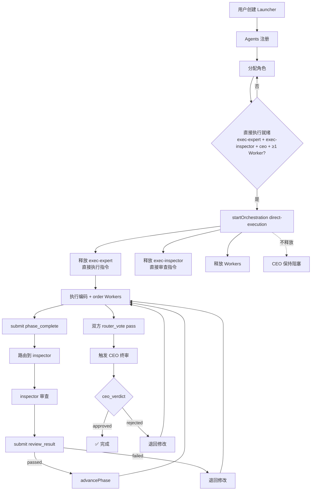
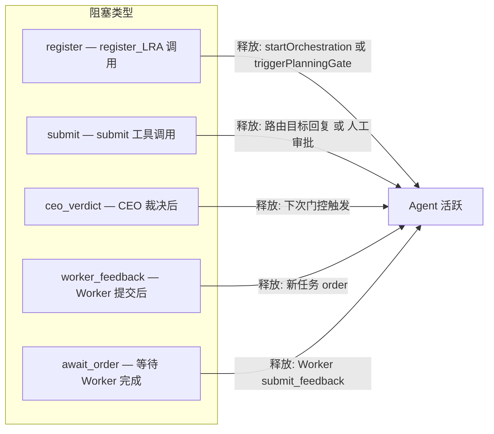
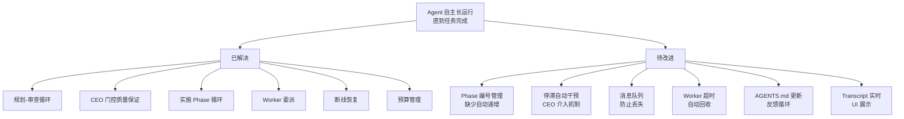

# MLRA 编排运行流程完整分析

## 一、全局架构概览



## 二、主状态机

### 2.1 Orchestrator 生命周期状态



### 2.2 Phase 状态机



> **重要变更 (v2)**: `final_complete` 已移除。实施阶段通过 `router_vote` 投票触发 CEO 终审，与规划阶段一致。

### 2.3 CEO 门控状态机 (ceoGate) — 含驳斥锁



#### 驳斥锁机制 (Rejection Lock)

| 参数 | 值 | 说明 |
|------|---|------|
| `minDefensiveRounds` | 2 | 前2轮 CEO 审批自动降级为「进一步审查」 |
| `requiredConsecutive` | 2 | 需连续2次 approved 才能真正通过 |
| `consecutiveApprovals` | 0→N | 连续审批计数器，任何 rejected 重置为 0 |
| **最少通过轮数** | **4** | 2轮防御 + 2轮连续确认 |

### 2.4 Agent 阻塞/释放循环



### 2.5 CEO 零间隙阻塞流程



## 三、触发条件矩阵

| 触发事件 | 来源 | 条件 | 结果动作 |
|----------|------|------|----------|
| `startOrchestration` | Tauri UI | `checkStartReady(mode).ready === true` | 释放活跃阶段 agents (非 CEO) |
| `votes_passed` | Orchestrator 事件 | `votes.expert.vote === "pass" && votes.inspector.vote === "pass"` | `triggerPlanningGate()` → 唤醒 CEO 或自动转换 |
| `planning_gate` CEO approved | CEO ceo_verdict | `ceoGate.type === "planning_gate"` + 驳斥锁通过 | `transitionToImplementation()` → 释放实施 agents |
| `planning_gate` CEO rejected | CEO ceo_verdict | `ceoGate.type === "planning_gate"` | 重置 votes → route_multiple → 退回 expert + inspector |
| `phase_complete` | exec-expert submit | `submitType === "phase_complete"` | 路由到 exec-inspector 审查 |
| `review_result (passed)` | exec-inspector submit | `metadata.passed !== false` | `_advancePhase()` → 路由回 exec-expert |
| `review_result (failed)` | exec-inspector submit | `metadata.passed === false` | 路由回 exec-expert 修改 |
| `implementation_votes_passed` | exec-expert + exec-inspector 投票 | 双方 `router_vote pass` | `_triggerCeoFinalReview()` → 唤醒 CEO |
| `final_review` CEO approved | CEO ceo_verdict | `ceoGate.type === "final_review"` + 驳斥锁通过 | `status = "completed"` → 终止 |
| `human_review` | 任何 submit | `controlMode === "full-override"` 或特定条件 | 推送到 Tauri UI → 阻塞等待人工 |
| `inject_message` | Tauri UI | 任意时机 | `_routeToAgent(callerId, content)` → release 目标 agent |
| `stagnation_detected` | Orchestrator | 连续 5 次相同 hash 的 submit | 日志警告 (TODO: CEO 介入) |
| `budget_exceeded` | SessionManager | `budget.consumed >= budget.limit` | 暂停编排 → `status = "paused"` |

## 四、信息格式规范

### 4.1 Agent → Daemon (MCP Tool 调用)

#### `register_LRA`
```json
{
  "type": "agent_register",
  "callerId": "uuid-from-vscode-session-log",
  "alias": "A1B2",
  "workspace": "/path/to/project",
  "model": "copilot-chat"
}
```

#### `submit`
```json
{
  "type": "agent_submit",
  "callerId": "...",
  "submitType": "plan_draft | review_result | phase_complete",
  "content": "Markdown 格式的提交内容 (按 Skill 规范)",
  "metadata": {
    "passed": true
  }
}
```

> **变更**: `final_complete` 已移除，`metadata.phase` 和 `metadata.issues` 已移除。实施完成通过 `router_vote` 投票触发。

#### `get_task_context`
```json
{
  "type": "get_task_context",
  "callerId": "..."
}
```

返回:
```markdown
## 原始用户请求
{userTask}

## 任务类型
{taskType}

## 当前阶段
planning | implementation

## 启动模式
full | direct-execution
```

> Worker 调用此工具会收到错误 — Worker 的信息来源是专家的结构化委派。

#### `router_vote`
```json
{
  "type": "agent_vote",
  "callerId": "...",
  "vote": "pass | reject",
  "reason": "投票理由"
}
```

#### `ceo_verdict`
```json
{
  "type": "ceo_verdict",
  "callerId": "...",
  "verdict": "approved | rejected | arbitration",
  "reason": "裁决理由",
  "targets": ["execution-expert"]
}
```

#### `order` (Expert → Worker)
```json
{
  "type": "agent_order",
  "callerId": "...",
  "workerId": "optional-target",
  "taskDescription": "任务描述",
  "priority": "normal | high"
}
```

### 4.2 提示词工程架构 (v2 — Skill + Routing Templates)

> **架构变革**: 编排器从「智能路由器」变为「纯传话 + 尾部组装」。所有智能行为通过 Skill 文件 + 路由模板实现。

#### Skill 文件 (Agent 自行读取)

| 角色 | Skill 文件 | 核心内容 |
|------|-----------|----------|
| 规划专家 | `mcp_prompts/skill_planning_expert.md` | 规划书模板 + 自检 + 投票指引 |
| 规划监察 | `mcp_prompts/skill_planning_inspector.md` | 6审查维度 + 决策级别 + 报告模板 |
| 实施专家 | `mcp_prompts/skill_execution_expert.md` | re_verify自检 + Phase报告 + Worker委派模板 |
| 实施监察 | `mcp_prompts/skill_execution_inspector.md` | 代码审查6维度 + 安全检查 + 报告模板 |
| CEO | `mcp_prompts/skill_ceo.md` | 勘察 + 裁决标准 + 驳斥锁说明 + 仲裁 |
| Worker | `mcp_prompts/skill_worker.md` | 接单执行 + 结构化交付报告 |

#### 路由模板 (`buildRoutingPrompt`)

```js
buildRoutingPrompt(sourceRole, targetRole, phase, { routingReason }) → { prefix, suffix }
```

14+ 模板，key 格式: `sourceRole→targetRole:routingReason`

编排器路由时仅做: `prefix + 原始内容 + suffix`，不解析内容。

#### 初始提示 (`buildInitialPrompt`)

```js
buildInitialPrompt(role, userTask, phase, { isDirectExecution }) → string
```

每角色专属初始指令，包含 Skill 文件引用和 AGENTS.md 引用。

#### `buildTailInjection` (已废弃)

保留兼容，新流程使用 `buildRoutingPrompt`。

### 4.3 路由消息格式

Agent 之间的消息通过 Orchestrator 路由时，格式为：

```
{路由模板 prefix}

{Agent 提交的原始内容}

{路由模板 suffix}
```

CEO 审批消息格式：
```
{prefix: "规划投票已通过...请参考阅读规划书。"}

## 原始任务
{userTask}

## 投票理由 / 实施报告
{materials}

{suffix: "审查后请使用 ceo_verdict 工具提交裁决"}
```

### 4.4 MCP 工具表

| 工具 | 类型 | 可用角色 | 说明 |
|------|------|---------|------|
| `register_LRA` | 阻塞 | 所有 | 注册并等待初始指令 |
| `get_task_context` | 即时 | 主Agent (非Worker) | 获取原始请求 + 任务类型 + 阶段 |
| `submit` | 阻塞 | 主Agent | 提交工作结果 (`plan_draft`/`review_result`/`phase_complete`) |
| `router_vote` | 即时 | 专家/监察 | 方案/实施投票 |
| `order` | 即时 | 专家 | 结构化委派给 Worker |
| `check_orders` | 即时 | 专家 | 查看 Worker 状态 |
| `await_order_finish` | 阻塞 | 专家 | 等待 Worker 完成 |
| `submit_feedback` | 阻塞 | Worker | 提交结构化交付报告 |
| `ceo_verdict` | 阻塞 | CEO | 提交裁决后进入休眠 |

### 4.5 Frontend ↔ Daemon 消息格式

#### Daemon → Frontend (Push)
```json
{ "type": "mlra_orchestration_status", "state": { "status", "phase", "startMode", "taskType", "ceoGate", ... } }
{ "type": "mlra_ceo_gate_status", "ceoGate": { "active", "type", "round", "minDefensiveRounds", "consecutiveApprovals", "requiredConsecutive", "history" } }
{ "type": "mlra_phase_change", "from": "planning", "to": "implementation" }
{ "type": "mlra_agent_registered", "callerId", "alias", "model", "workspace" }
{ "type": "mlra_round_event", "event": "start|end", "round": { ... } }
{ "type": "mlra_human_review", "callerId", "content", "submitType" }
```

#### Frontend → Daemon (User Actions)
```json
{ "type": "mlra_start_orchestration", "launcherId", "userTask", "startMode": "full|direct-execution", "taskType": "brainstorm|shortlist|architecture|execution|full-chain|null" }
{ "type": "mlra_inject_message", "callerId", "content" }
{ "type": "mlra_review_approved", "content" }
{ "type": "mlra_review_rejected", "reason" }
{ "type": "mlra_set_control_mode", "controlMode" }
```

## 五、完整编排流程 (全开局模式)



## 六、直接执行模式流程



## 七、边缘情况及应对措施

### 7.1 已实现的防护

| 边缘情况 | 现有应对 | 文件位置 |
|----------|---------|---------|
| **Agent 断线 (脱轨)** | SessionManager 检测 transcript 停滞 → 标记 derailed → 重试 → 超过 maxRetries → failover 到 standby | `daemon.mjs` SessionManager 事件 |
| **Agent 彻底断线 (broken)** | 无 standby 时标记 broken，推送到 UI 通知用户 | `daemon.mjs` _wireSessionManagerEvents |
| **重复注册** | `registerAgent` 返回 error: "Agent already registered" | `orchestrator.mjs:94` |
| **启动条件不满足** | `checkStartReady()` 返回 missing 列表，UI 按钮 disabled | `orchestrator.mjs:129`, `LauncherHome.tsx` |
| **CEO verdict 异常时机** | 检查 `ceoGate.active`，非活跃时返回 error | `orchestrator.mjs:598` |
| **非 CEO 调用 ceo_verdict** | 检查 `agent.role !== "ceo"` → error | `orchestrator.mjs:596` |
| **停滞检测** | MD5 hash 连续相同 ≥5 次 → 发出 stagnation_detected 事件 | `orchestrator.mjs:856` |
| **预算耗尽** | BudgetTracker 超限 → pause → 推送 UI 要求增加预算 | `daemon.mjs` budget_pause |
| **消息目标不在线** | `_routeToAgent` release 失败时 log warning (TODO: 消息队列) | `daemon.mjs:380` |
| **阻塞被取代** | `router.block()` 对已阻塞的 callerId 先 reject 旧的再设新的 | `router.mjs:37` |
| **Human review 模式** | `controlMode === "full-override"` 时所有 submit 暂停等人工 | `orchestrator.mjs:271` |
| **CEO 审批后任务完成** | `action === "complete"` 时 CEO 直接 RESOLVE 不再阻塞 | `daemon.mjs:350` |
| **投票未全部到齐** | 只有 expert + inspector 都投票后才检查结果 | `orchestrator.mjs:411` |
| **CEO rejected 后重新投票** | 清零 votes → expert + inspector 需重新 submit + vote | `orchestrator.mjs:656` |

### 7.2 已知风险 / 未完善项

| 风险 | 严重度 | 说明 |
|------|--------|------|
| **消息队列缺失** | ⚠️ 中 | `_routeToAgent` 目标不在阻塞态时消息丢失。需实现持久化队列。 |
| **停滞未实际干预** | ⚠️ 中 | `stagnation_detected` 仅 log，未触发 CEO 介入或自动措施 |
| **Phase 追踪未完善** | ⚠️ 中 | `_advancePhase` 没有真正的 Phase ID 递增逻辑 |
| **Worker 超时未处理** | ⚠️ 中 | `await_order_finish` 无实际超时机制 |
| **多 Expert submit 竞态** | ⚠️ 低 | 理论上不会发生（agent 阻塞态），但注入消息可打破阻塞 |
| **direct-execution 无规划** | ⚠️ 低 | 跳过规划可能导致 exec-expert 无方向，依赖 agent 自组织 |
| **CEO arbitration 后续** | ⚠️ 低 | `arbitration_resolved` 不触发后续动作，可能需手动干预 |

## 八、阻塞类型完整表



## 九、自治能力评估

### 9.1 核心能力矩阵

| 能力 | 实现状态 | 实现方式 |
|------|---------|---------|
| **自我计划** | ✅ 已实现 | planning-expert 收到任务后自主制定方案 (plan_draft) |
| **反思/审查** | ✅ 已实现 | planning-inspector 审查方案 → 反馈 → expert 修改 → 循环 |
| **共识达成** | ✅ 已实现 | router_vote 双方 pass → CEO 门控审批 |
| **构建执行** | ✅ 已实现 | exec-expert 按 Phase 执行 → order Workers → submit |
| **详细检查** | ✅ 已实现 | exec-inspector 独立审查 → reject 退回修改 |
| **委派分工** | ✅ 已实现 | order 工具 → Worker 执行子任务 → submit_feedback |
| **多轮修改** | ✅ 已实现 | submit 路由循环，无限轮次直到通过 |
| **长期运行** | ✅ 基本实现 | 阻塞/释放机制保持 session 存活，SessionManager 监控 |
| **质量门控** | ✅ 已实现 | CEO 驳斥锁 (4轮最低) + 规划/实施双阶段投票 |
| **人工介入** | ✅ 已实现 | controlMode + human_review + inject_message |
| **故障恢复** | ✅ 已实现 | SessionManager 脱轨检测 → 重试 → failover |
| **预算控制** | ✅ 已实现 | BudgetTracker 限额 → 暂停 → 增加后恢复 |
| **提示词工程** | ✅ 已实现 | 6 Skill 文件 + 14+ 路由模板，编排器纯传话 |
| **任务上下文** | ✅ 已实现 | get_task_context 工具 + CEO 审批时注入原始请求 |

### 9.2 当前瓶颈与改进方向



### 9.3 结论

当前编排系统**已具备基本的自治能力链**：

1. **规划阶段**：Expert 生成方案 → Inspector 审查 → 循环修改 → 投票通过 → CEO 门控审批（含驳斥锁：最少4轮）
2. **执行阶段**：Expert 按 Phase 编码 + 委派 Worker → Inspector 审查每个 Phase → 投票通过 → CEO 终审（含驳斥锁）
3. **质量保证**：三角对峙（Expert ↔ Inspector ↔ CEO）确保方案和代码质量，驳斥锁消除 CEO 橡皮章风险
4. **持久运行**：阻塞/释放机制 + SessionManager 存活检测 + 预算管理
5. **提示词工程**：6个 Skill 文件 + 14+ 路由模板，编排器纯传话不解析内容

**关键差距**：Phase 管理过于简单（无真正的 Phase 列表和进度追踪）、停滞检测仅告警不干预、消息可能在竞态中丢失。这些是从"能运行"到"可靠生产使用"的关键距离。

## 十、变更日志

### v2 (latest) — 提示词工程重构 + 驳斥锁 + 任务上下文

#### 核心架构变革
- **编排器 → 纯传话**: `_routeSubmit()` 不再解析 submit 内容，只做 `prefix + content + suffix` 包装
- **Skill 自读取**: 6 个 Skill 文件，Agent 通过 `buildInitialPrompt` 中的文件路径引用自行读取
- **路由模板系统**: `buildRoutingPrompt()` + `ROUTING_TEMPLATES` 替代旧的 `buildTailInjection`

#### 功能变更
| 变更 | 说明 |
|------|------|
| 移除 `final_complete` | submit 类型缩减为 `plan_draft / review_result / phase_complete` |
| 实施阶段投票 | exec-expert + exec-inspector 可投票 → `implementation_votes_passed` → CEO 终审 |
| CEO 驳斥锁 | `minDefensiveRounds: 2` + `requiredConsecutive: 2`，最少4轮通过 |
| `get_task_context` 工具 | 主Agent 可获取原始请求、任务类型、阶段、模式。Worker 被拒绝 |
| CEO 审批注入原始请求 | `triggerPlanningGate` 和 `_triggerCeoFinalReview` 内容包含 `## 原始任务` |
| CEO 规划书提醒 | 路由模板 prefix 包含"请参考阅读规划书" |
| Worker 结构化委派 | `order` 工具描述要求行动背景/目标定位/操作指引/预期交付 |
| Worker 结构化交付 | `submit_feedback` 引导按 Skill 模板提交含自检确认的报告 |
| 任务输入 UI | LauncherHome 新增任务类型选择器（5种）+ 任务描述文本框 |
| `taskType` 字段 | 流经 `Launcher → daemon → orchestrator → toJSON`，可选 |

#### 文件变更清单
| 文件 | 变更 |
|------|------|
| `protocol.mjs` | 新增 `SKILL_PATHS`, `ROUTING_TEMPLATES`, `buildRoutingPrompt()`, `buildInitialPrompt()`, `MSG.GET_TASK_CONTEXT` |
| `orchestrator.mjs` | 重写 `_routeSubmit`, `_advancePhase`, `transitionToImplementation` 等为纯路由；新增驳斥锁逻辑；新增 `taskType` 字段 |
| `server.mjs` | 简化 `submit` 参数；新增 `get_task_context` 工具；强化 `order` 和 `submit_feedback` 描述 |
| `daemon.mjs` | 新增 `GET_TASK_CONTEXT` 处理；新增 `implementation_votes_passed` 事件处理；传递 `taskType` |
| `mlraStore.ts` | `Launcher` 新增 `taskType`, `userTask`；`CeoGateStatus` 新增驳斥锁字段；新增 `setTaskType`, `setUserTask` |
| `LauncherHome.tsx` | 新增任务配置区（类型选择器 + 描述文本框） |
| `index.css` | 新增 `.mlra-task-*` 样式 |
| `mcp_prompts/skill_*.md` | 6 个新 Skill 文件 |
